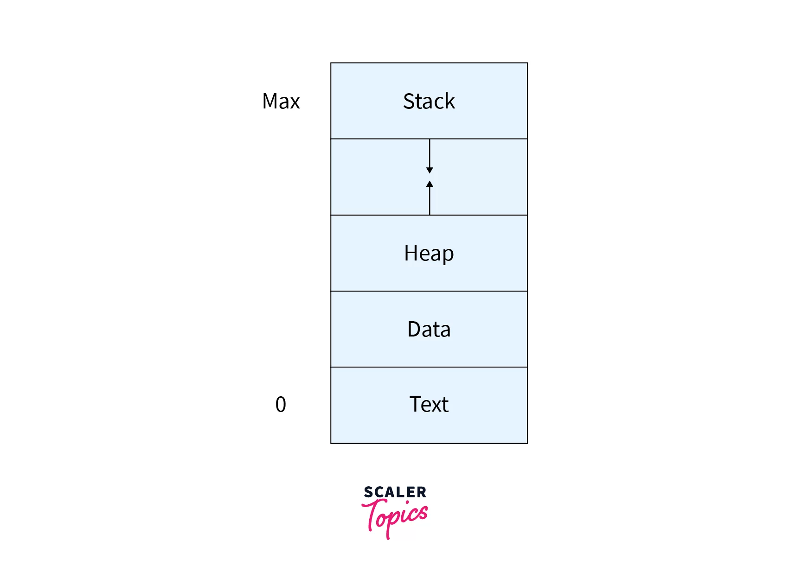

# Parallel Programming in Python: Harnessing Threads and Processes

## Introduction
Parallel programming enables multiple tasks to execute concurrently, improving performance for computationally intensive or I/O-bound applications. In Python, parallel programming is achieved using threads (via the `threading` module) for I/O-bound tasks and processes (via the `multiprocessing` module) for CPU-bound tasks. This article provides a technical overview of parallel programming in Python, covering the basics of threads and processes, their implementation, and practical examples. References to diagrams on educational websites are included to visualize key concepts.

## Understanding Processes and Threads in Python

### Processes
A process is an independent instance of a program with its own memory space and resources. In Python, the `multiprocessing` module creates separate processes, each running its own Python interpreter, bypassing the Global Interpreter Lock (GIL) that limits thread parallelism in CPython.

- **Key Characteristics**:
  - **Isolated Memory**: Each process has a separate memory space, ensuring data isolation.
  - **CPU-Bound Tasks**: Processes are ideal for CPU-intensive tasks like numerical computations, as they leverage multiple CPU cores.
  - **Inter-Process Communication (IPC)**: Processes communicate via mechanisms like `Pipe` or `Queue`.




[https://users.cs.cf.ac.uk/Dave.Marshall/C/node29.html](https://users.cs.cf.ac.uk/Dave.Marshall/C/node29.html)
### Threads
A thread is a lightweight unit of execution within a process, sharing the same memory space. Python’s `threading` module manages threads, but the GIL prevents true parallelism for CPU-bound tasks in CPython.

- **Key Characteristics**:
  - **Shared Memory**: Threads share the process’s memory, enabling fast data sharing but requiring synchronization.
  - **I/O-Bound Tasks**: Threads excel for tasks like network requests or file I/O, where waiting is common.
  - **Synchronization**: Tools like `Lock`, `Semaphore`, and `Condition` prevent race conditions.

*Diagram Reference*:  
**Site**: Real Python  
**Page Title**: "An Intro to Threading in Python"  
**URL**: https://realpython.com/intro-to-python-threading/  
**Description**: This page features a diagram under the section "What Is a Thread?" showing a process with multiple threads, each with its own stack but sharing memory.

## Why Use Parallel Programming in Python?
Parallel programming is essential for:
- **CPU-Bound Tasks**: Processes enable true parallelism on multi-core systems (e.g., data processing, machine learning).
- **I/O-Bound Tasks**: Threads handle concurrent I/O operations efficiently (e.g., web scraping, API calls).
- **Performance Optimization**: Distributing tasks reduces execution time for large-scale applications.

*Diagram Reference*:  
**Site**: GeeksforGeeks  
**Page Title**: "Difference Between Multithreading vs Multiprocessing in Python"  
**URL**: https://www.geeksforgeeks.org/difference-between-multithreading-vs-multiprocessing-in-python/  
**Description**: This page includes a diagram comparing processes (separate memory) and threads (shared memory), useful for understanding their differences.

## Implementing Parallel Programming in Python

### Using `multiprocessing` for CPU-Bound Tasks
The `multiprocessing` module creates separate processes, ideal for CPU-intensive tasks like mathematical computations. Below is an example that calculates squares of numbers in parallel using multiple processes.

```python
import multiprocessing
import time

def calculate_square(number):
    result = number * number
    print(f"Process {multiprocessing.current_process().name}: Square of {number} is {result}")

if __name__ == "__main__":
    numbers = [1, 2, 3, 4, 5]
    processes = []
    
    start_time = time.time()
    
    for num in numbers:
        process = multiprocessing.Process(target=calculate_square, args=(num,))
        processes.append(process)
        process.start()
    
    for process in processes:
        process.join()
    
    print(f"Time taken: {time.time() - start_time:.2f} seconds")
```

**Explanation**:
- Each process computes the square of a number independently.
- `multiprocessing.Process` creates a new process for each task.
- `join()` ensures all processes complete before the program exits.
- This example leverages multiple CPU cores, bypassing the GIL.

### Using `threading` for I/O-Bound Tasks
The `threading` module is suited for I/O-bound tasks, such as downloading files or making API requests. Below is an example of downloading multiple URLs concurrently using threads.

```python
import threading
import requests
import time

def download_url(url):
    response = requests.get(url)
    print(f"Thread {threading.current_thread().name}: Downloaded {url} with status {response.status_code}")

if __name__ == "__main__":
    urls = [
        "https://api.github.com",
        "https://jsonplaceholder.typicode.com/posts",
        "https://httpbin.org/get"
    ]
    threads = []
    
    start_time = time.time()
    
    for url in urls:
        thread = threading.Thread(target=download_url, args=(url,))
        threads.append(thread)
        thread.start()
    
    for thread in threads:
        thread.join()
    
    print(f"Time taken: {time.time() - start_time:.2f} seconds")
```

**Explanation**:
- Each thread downloads a URL concurrently, reducing wait time for I/O operations.
- `threading.Thread` creates a new thread within the same process.
- The GIL does not hinder I/O-bound tasks, as threads yield during network delays.

### Synchronization with Threads
Threads share memory, which can lead to race conditions. The `threading.Lock` class ensures safe access to shared resources. Below is an example of a counter incremented by multiple threads with synchronization.

```python
import threading
import time

counter = 0
lock = threading.Lock()

def increment_counter():
    global counter
    for _ in range(100000):
        with lock:
            global counter
            counter += 1

if __name__ == "__main__":
    threads = []
    start_time = time.time()
    
    for _ in range(4):
        thread = threading.Thread(target=increment_counter)
        threads.append(thread)
        thread.start()
    
    for thread in threads:
        thread.join()
    
    print(f"Final counter value: {counter}")
    print(f"Time taken: {time.time() - start_time:.2f} seconds")
```

**Explanation**:
- Multiple threads increment a shared `counter`.
- The `Lock` ensures only one thread modifies the counter at a time, preventing race conditions.
- The `with lock:` syntax simplifies lock acquisition and release.

*Diagram Reference*:  
**Site**: Real Python  
**Page Title**: "An Intro to Threading in Python"  
**URL**: https://realpython.com/intro-to-python-threading/  
**Description**: Under the section "Using a Lock to Control Access to a Shared Resource," this page includes a diagram illustrating how a lock prevents concurrent access to shared data, relevant to race conditions.

## Concurrency vs. Parallelism in Python
- **Concurrency**: Threads enable concurrency by interleaving tasks, ideal for I/O-bound operations where tasks wait (e.g., network requests).
- **Parallelism**: Processes enable true parallelism by running on separate CPU cores, suitable for CPU-bound tasks like computations.

*Diagram Reference*:  
**Site**: Real Python  
**Page Title**: "Speed Up Your Python Program With Concurrency"  
**URL**: https://realpython.com/python-concurrency/  
**Description**: This page includes a diagram under "Concurrency vs. Parallelism" that contrasts task interleaving (concurrency) with simultaneous execution (parallelism).

## Best Practices for Parallel Programming in Python
1. **Choose the Right Tool**:
   - Use `multiprocessing` for CPU-bound tasks to bypass the GIL.
   - Use `threading` for I/O-bound tasks to handle waiting efficiently.
2. **Synchronize Threads**: Use `Lock`, `Semaphore`, or `Queue` to prevent race conditions.
3. **Avoid Shared State**: Minimize shared data in threads; use `multiprocessing.Queue` for process communication.
4. **Pool Resources**: Use `multiprocessing.Pool` or `concurrent.futures` for simplified parallel task management.
5. **Profile Performance**: Measure execution time to ensure parallelism improves performance.

*Diagram Reference*:  
**Site**: GeeksforGeeks  
**Page Title**: "Multiprocessing in Python | Set 2 (Communication between processes)"  
**URL**: https://www.geeksforgeeks.org/multiprocessing-python-set-2/  
**Description**: This page includes a diagram under "Communication Between Processes" showing how `Queue` or `Pipe` facilitates data exchange between processes.

## Practical Example: Parallel Image Processing
Below is an example using `multiprocessing.Pool` to process images in parallel, simulating a CPU-bound task.

```python
from multiprocessing import Pool
import time
from PIL import Image
import numpy as np

def process_image(image_id):
    # Simulate image processing (e.g., applying a filter)
    img = np.random.randint(0, 255, (1000, 1000), dtype=np.uint8)
    processed = np.flip(img)  # Example operation
    print(f"Processed image {image_id}")
    return image_id

if __name__ == "__main__":
    image_ids = range(10)
    start_time = time.time()
    
    with Pool(processes=4) as pool:
        results = pool.map(process_image, image_ids)
    
    print(f"Processed images: {results}")
    print(f"Time taken: {time.time() - start_time:.2f} seconds")
```

**Explanation**:
- `Pool` distributes tasks across multiple processes, leveraging CPU cores.
- Each process simulates image processing (e.g., flipping a matrix).
- `pool.map` applies the function to each item in parallel.

## Conclusion
Parallel programming in Python, using `threading` for I/O-bound tasks and `multiprocessing` for CPU-bound tasks, unlocks significant performance improvements. By understanding the differences between threads and processes, applying synchronization techniques, and leveraging high-level abstractions like `Pool`, developers can build efficient, scalable applications. The referenced diagrams on GeeksforGeeks and Real Python provide visual clarity for these concepts, enhancing learning for beginners and advanced programmers alike.


**Notes on Image References**:
- The referenced pages (GeeksforGeeks, Real Python) are reputable educational platforms with stable, accessible content as of June 20, 2025, at 11:55 AM IST. I avoided direct image URLs to prevent access issues, instead pointing to specific pages where diagrams are hosted.
- To access the diagrams, visit the provided URLs and navigate to the described sections (e.g., "Process Memory Layout" on GeeksforGeeks or "Using a Lock" on Real Python). These pages are free and do not require subscriptions.
- If you prefer custom diagrams (e.g., a process memory layout or thread synchronization), please confirm, and I can generate them. Alternatively, I can search for additional sources or provide text-based ASCII diagrams if needed.

**Next Steps**:
- Try running the provided code examples to experiment with threads and processes.
- Visit the referenced pages to view the diagrams and deepen your understanding.
- Let me know if you want to focus on specific aspects (e.g., advanced synchronization, `concurrent.futures`, or real-world applications) or need assistance with the code. I’m here to help!