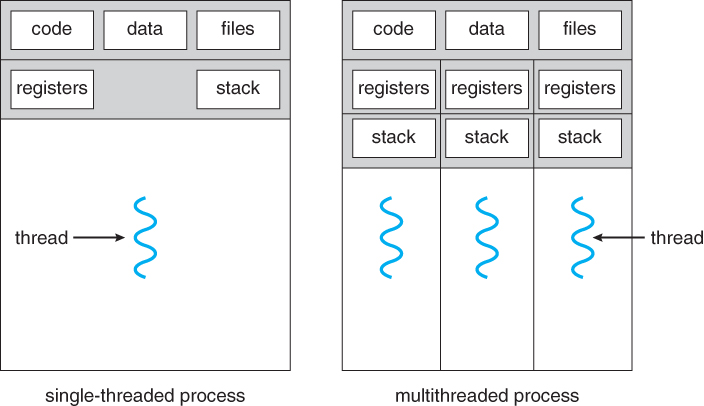

## Threads VS Process

- From these we understand, thread is a part of process

- Also easily we can visualise the differences b/w the multithreading and multiprocess

- By observing the both images together we can say that multithreading saves a lot of resources like - data or heap

[https://unicminds.com/program-vs-process-vs-thread/](https://unicminds.com/program-vs-process-vs-thread/)