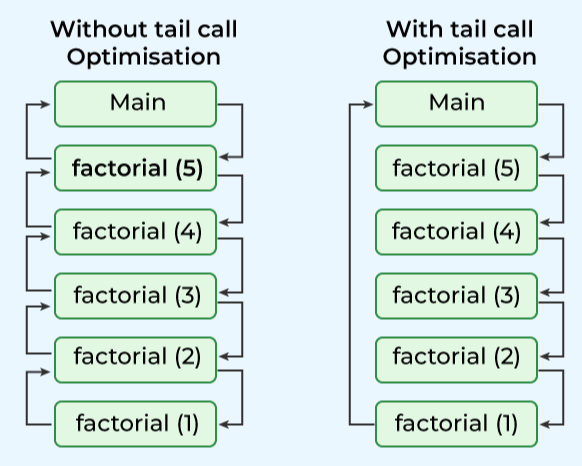
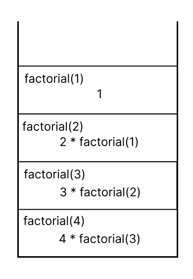
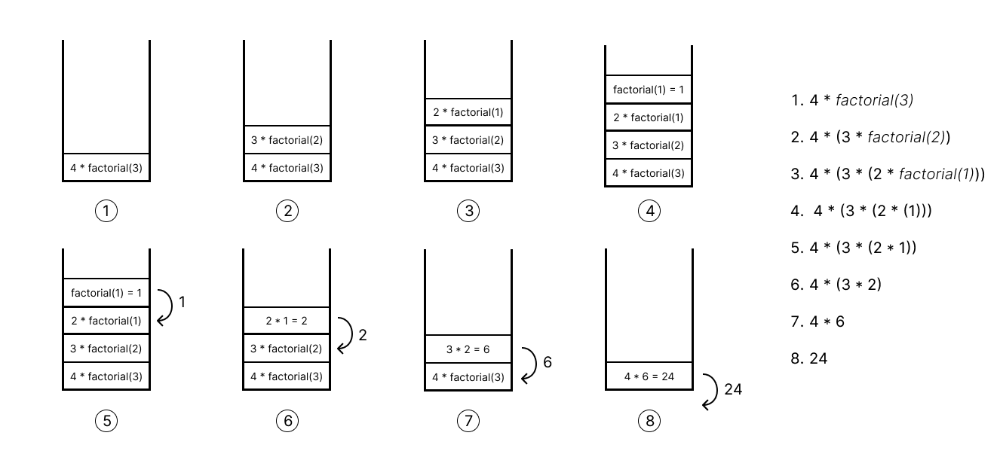
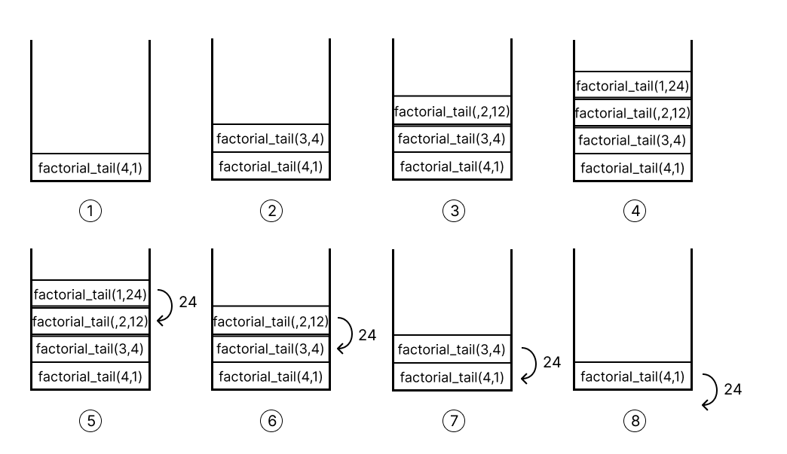
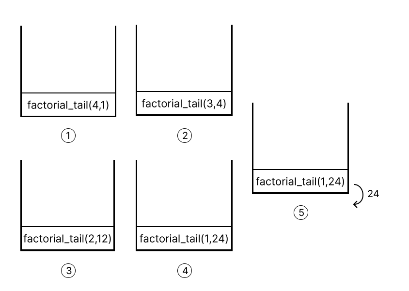

# Tail Recursion and Tail Call Optimization in Python


There is a difference between Tail Recursion and Tail Call Optimization (TCO) — they are related concepts, but not the same thing.

### Tail Recursion
- A tail-recursive function is a function where the recursive call is the last operation in the function.

- There is nothing left to do after the recursive call returns.


### Tail Call Optimization (TCO)
- TCO is a compiler or interpreter optimization that reuses the current function's stack frame for a tail call, instead of adding a new one.

- This prevents stack overflow in tail-recursive functions, making recursion as efficient as iteration.

<br>

> - Just because a function is tail-recursive doesn’t mean it gets tail call optimization — the language runtime must support it.
>
>- Python supports tail recursion syntax, but does not implement TCO, so tail-recursive functions still cause a stack overflow on deep recursion

<figure>
    
    <figcaption style="text-align: center;">A comparison b/w with and without TOC. 
    This basically shows the flow when each function is "called". For better understanding compare it with the memory stack image in the following portion
(Image Credits:GeeksforGeek)
    </figcaption>
  </figure>

<br>

---

| Concept                     | Tail Recursion                             | Tail Call Optimization (TCO)               |
| --------------------------- | ------------------------------------------ | ------------------------------------------ |
| What it is                  | A function calling itself as the last step | A runtime optimization for tail calls      |
| Where it applies            | Code structure                             | Compiler/interpreter implementation        |
| Guarantees no stack growth? | <text style="color:#ffc3bd">Not always </text>                              | <text style="color:#d2fcdf"> Yes, if supported </text>                       |
| Supported in Python?        | <text style="color:#d2fcdf"> Yes (can write tail-recursive functions)</text> |  <text style="color:#ffc3bd">No (Python does not optimize tail calls)</txt> |

<br>

---

<br>

<details open>
<summary><b> Low-Level Perspective: Assembly and Stack Frame Reuse</b>
</summary>
<br>

To understand how TCO reuses the stack frame, let’s look at a simplified assembly representation of `factorial_tail` in C with TCO enabled (e.g., GCC with `-O2`).

<table>

<tr>
<th> 
Without TCO (Simplified Assembly)
</th>
<th>
With TCO (Simplified Assembly)
</th>
</tr>
<tr>
<td>
Without TCO, each recursive call would involve:

<br>

```
factorial_tail:
    push rbp          ; Save base pointer (new stack frame)
    mov rbp, rsp      ; Set up new frame
    sub rsp, 16       ; Allocate space for locals
    mov [rbp-8], rdi  ; Store n (first argument)
    mov [rbp-16], rsi ; Store acc (second argument)
    cmp [rbp-8], 1    ; Compare n <= 1
    jle base_case     ; Jump if base case
    mov rdi, [rbp-8]  ; n
    dec rdi           ; n - 1
    mov rsi, [rbp-8]  ; n
    imul rsi, [rbp-16]; n * acc
    call factorial_tail ; Recursive call (new frame)
    jmp end
base_case:
    mov rax, [rbp-16] ; Return acc
end:
    leave             ; Restore stack
    ret               ; Return
```

Each call factorial_tail pushes a new frame (return address, parameters, etc.), growing the stack.
</td>
<td>
With TCO enabled, the compiler optimizes the tail call into a jump:

<br>

```
factorial_tail:
    mov rbx, rdi      ; rbx = n (first argument)
    mov rcx, rsi      ; rcx = acc (second argument)
loop:
    cmp rbx, 1        ; Compare n <= 1
    jle base_case     ; Jump if base case
    mov rax, rbx      ; rax = n
    imul rcx, rax     ; acc = n * acc
    dec rbx           ; n = n - 1
    mov rdi, rbx      ; Update first argument (n)
    mov rsi, rcx      ; Update second argument (acc)
    jmp loop          ; Jump to start (reuse frame)
base_case:
    mov rax, rcx      ; Return acc
    ret               ; Return to original caller
```
</td>
</tr>
</table>


#### Key Differences:
- No call instruction for the recursive call; instead, a `jmp` (jump) reuses the same frame.
- No stack growth: The stack pointer (`rsp`) doesn’t change for each “call.”
- Parameters are updated in registers (`rbx`, `rcx`) or on the stack, but no new frame is pushed.

#### Stack Frame Reuse:
- The initial frame is set up once (e.g., in `main` calling `factorial_tail`).
- The `jmp` loop updates `n` and `acc` in place, looping within the same frame until the base case.


</details>

<br>

---
<br>


## Non-Tail Recursive Implementation in Python

The non-tail-recursive factorial function computes `n!` by multiplying `n` with the result of `factorial(n-1)` after the recursive call returns. Here’s the Python equivalent of a non-tail-recursive factorial:

```python
def factorial(n):
    if n == 0 or n == 1:
        return 1
    else:
        return n * factorial(n - 1)
```

### Stack Calculation for `factorial(5)`
When you call `factorial(5)`, the Python interpreter evaluates the function by building a call stack, where each recursive call is added as a new stack frame. The computation is deferred until the base case is reached, and then the stack unwinds to perform the multiplications. Here’s the step-by-step stack calculation:

1. **Initial Call**: `factorial(5)`
   - The function checks if `n == 0 or n == 1` (false, since `n = 5`).
   - It needs to compute `5 * factorial(4)`, but `factorial(4)` is unknown, so a new stack frame is created for `factorial(4)`.

2. **Recursive Call**: `factorial(4)`
   - Checks if `n == 0 or n == 1` (false, `n = 4`).
   - Needs to compute `4 * factorial(3)`, so a new stack frame is created for `factorial(3)`.

3. **Recursive Call**: `factorial(3)`
   - Checks if `n == 0 or n == 1` (false, `n = 3`).
   - Needs to compute `3 * factorial(2)`, so a new stack frame is created for `factorial(2)`.

4. **Recursive Call**: `factorial(2)`
   - Checks if `n == 0 or n == 1` (false, `n = 2`).
   - Needs to compute `2 * factorial(1)`, so a new stack frame is created for `factorial(1)`.

5. **Recursive Call**: `factorial(1)`
   - Checks if `n == 0 or n == 1` (true, `n = 1`).
   - Returns `1` (base case reached).

6. **Unwinding the Stack**:
   - The stack now unwinds, resolving each pending multiplication:
     - `factorial(1)` returns `1`.
     - `factorial(2)` computes `2 * factorial(1) = 2 * 1 = 2`.
     - `factorial(3)` computes `3 * factorial(2) = 3 * 2 = 6`.
     - `factorial(4)` computes `4 * factorial(3) = 4 * 6 = 24`.
     - `factorial(5)` computes `5 * factorial(4) = 5 * 24 = 120`.


<br>

<div style="display: flex; gap: 2%;  justify-content: center; ">
  <figure style="width: 20%; margin: 0;">
    
    <figcaption style="text-align: center;">Recursion Stack</figcaption>
  </figure>

  <figure style="width: 60%; margin: 0;">
    
    <figcaption style="text-align: center;">Python Code Without using Tail Recursion</figcaption>
  </figure>
</div>

<br>

### Stack Frames
- At its peak, the stack still contains **5 frames** (for `n = 5, 4, 3, 2, 1`), just like the non-tail-recursive version.
- Each frame stores:
  - The value of `n`.
  - The value of `acc`.
  - The return address for the recursive call.
- Unlike the non-tail-recursive version, no pending operations (e.g., multiplication) are stored, as the accumulator handles the computation incrementally.

---

<table>

<tr>
<th> 

## Tail Recursion implementation in Python</th>
<th>

## Tail Recursion implementation in TOC supporting Language</th>
</tr>

<tr>
<td>


#### General Mechanism in Non-TCO-Supporting Languages

The process of handling recursive calls in non-TCO-supporting languages follows a general pattern:

1. **Detect Recursive Call**:

    The compiler/interpreter identifies a recursive call within the function, regardless of its position.

    Example: `return factorial_tail(n - 1, n * acc)`

2. **Prepare New Arguments**:

    Compute the arguments for the next call (e.g., `n - 1`, `n * acc`).

3. **Create New Stack Frame**:

    Allocate a new stack frame for the recursive call.

    In assembly, this involves pushing the current frame’s state (e.g., return address, parameters) onto the stack and adjusting the stack pointer (e.g., `call` instruction in x86_64).

    The new frame stores the updated parameters (`n`, `acc`) and a return address pointing back to the caller.

4. **Execute Recursive Call**:

    Invoke the function with the new stack frame, pushing it onto the call stack.

    This increases the stack depth by one for each recursive call.

5. **Base Case and Unwinding**:

    When the base case is reached, return the result (e.g., `acc`).

    The stack unwinds by popping each frame, passing the return value up to the previous caller, until the original caller is reached.


</td>

<td>

#### General Mechanism in TCO-Supporting Languages
The process of reusing the stack frame in TCO-supporting languages follows a general pattern:

1. **Detect Tail Call**: 
    
    The compiler/interpreter identifies a tail-recursive call (last operation in the function).

    Example: `return factorial_tail(n - 1, n * acc)`

2. **Prepare New Arguments**:

    Compute the arguments for the next call (e.g., `n - 1`, `n * acc`).

3. **Update Current Frame**:

    Overwrite the current frame’s parameters with the new values.

    In assembly, this might involve updating registers (e.g., `rdi`, `rsi` in x86_64) or stack slots.

    The return address remains unchanged, pointing to the original caller.

4. **Jump Instead of Call**:

    Use a jump instruction (e.g., `jmp` in assembly, or a `goto` in intermediate code) to the start of the function.

    This avoids pushing a new frame (no `call`, no stack pointer adjustment).

5. **Base Case and Return**:

    When the base case is reached, return directly to the original caller, using the single frame’s return address.
</td>
</tr>

<tr>
<td>

```python
def factorial_tail(n, acc=1):
    if n == 0 or n == 1:
        return acc
    else:
        return factorial_tail(n - 1, n * acc)
```
</td>
<td>
C Programe

```c
uint64_t factorial_tail(int n, uint64_t acc) {
    if (n <= 1) {
        return acc;
    }
    return factorial_tail(n - 1, n * acc);
}
```
C++ Programe
```c++
#include <cstdint>
uint64_t factorial_tail(int n, uint64_t acc = 1) {
    if (n <= 1) {
        return acc;
    }
    return factorial_tail(n - 1, n * acc);
}
```
</td>
</tr>

<tr>
<td>

### How Recursive Calls Are Made Without TCO
In a language without TCO (e.g., Python) or when TCO is disabled, a recursive call proceeds as follows:

1. **Current Frame Setup**:

    The current function (`factorial_tail(5, 1)`) has a stack frame containing:

    - Parameters: `n = 5`, `acc = 1`.
    - Return address: Where to return after the function completes.
    - Local variables (if any).

2. **Recursive Call**:
    
    The function calls `factorial_tail(4, 5)`.
A new stack frame is created for `factorial_tail(4, 5)`:
    - Parameters: `n = 4`, `acc = 5`.
    - Return address:  Points back to the caller (`factorial_tail(5, 1)`).

    The new frame is pushed onto the call stack.
3. **Stack Growth**:

    This process repeats for each recursive call, growing the stack: `factorial_tail(5, 1)`, `factorial_tail(4, 5)`, ..., `factorial_tail(1, 120)`.

    At peak, the stack has 5 frames.

4. **Unwinding**:

    When the base case (`n <= 1`) is reached, `120` is returned.
    
    The stack unwinds, popping each frame and passing the result up.


Space Complexity: O(n), where `n` is the recursion depth.

</td>
<td>

#### How Recursive Calls Are Made With TCO

In a language with TCO (e.g., C with optimization flags like `-O2`) or in environments that support TCO (e.g., Scheme), a tail-recursive call proceeds as follows:

1. **Current Frame Setup**:

    The current function (`factorial_tail(5, 1)`) has a stack frame containing:

    - Parameters: `n = 5`, `acc = 1`.
    - Return address: Where to return after the function completes (e.g., to `main`).
    - Local variables (if any).

2. **Recursive Call**:

    The function prepares to call `factorial_tail(4, 5)`.

    Instead of creating a new stack frame, the current frame is updated:

    - Parameters: `n` is set to `4`, `acc` is set to `5` (computed as `n * acc`).
    - Return address: Remains unchanged, still pointing to the original caller (`main`).

    No new frame is pushed onto the call stack.

3. **Stack Reuse**:

    This process repeats for each tail-recursive call, reusing the same stack frame: `factorial_tail(5, 1)` updates to `factorial_tail(4, 5)`, then to `factorial_tail(3, 20)`, ..., and finally to `factorial_tail(1, 120)`.

    At all times, the stack has only 1 frame.

4. **Base Case and Return**:

    When the base case (`n <= 1`) is reached, `120` is returned.

    The result is returned directly to the original caller using the single frame’s return address, with no unwinding needed.

Space Complexity: O(1), regardless of recursion depth.

</td>
</tr>

<tr>
<td>

</td>
<td>

</td>
</tr>


<tr>
<td>

<table border="1" cellpadding="4" cellspacing="0">
        <tr>
          <th>Time Step</th>
          <th>Stack Frames (Top to Bottom)</th>
          <th>Action</th>
        </tr>
        <tr>
          <td>T0</td>
          <td>factorial_tail(5, 1)</td>
          <td>Initial call</td>
        </tr>
        <tr>
          <td>T1</td>
          <td>
            factorial_tail(5, 1)<br>
            factorial_tail(4, 5)
          </td>
          <td>Call factorial_tail(4, 5)</td>
        </tr>
        <tr>
          <td>T2</td>
          <td>
            factorial_tail(5, 1)<br>
            factorial_tail(4, 5)<br>
            factorial_tail(3, 20)
          </td>
          <td>Call factorial_tail(3, 20)</td>
        </tr>
        <tr>
          <td>T3</td>
          <td>
            factorial_tail(5, 1)<br>
            factorial_tail(4, 5)<br>
            factorial_tail(3, 20)<br>
            factorial_tail(2, 60)
          </td>
          <td>Call factorial_tail(2, 60)</td>
        </tr>
        <tr>
          <td>T4</td>
          <td>
            factorial_tail(5, 1)<br>
            factorial_tail(4, 5)<br>
            factorial_tail(3, 20)<br>
            factorial_tail(2, 60)<br>
            factorial_tail(1, 120)
          </td>
          <td>Call factorial_tail(1, 120)</td>
        </tr>
        <tr>
          <td>T5</td>
          <td>
            factorial_tail(5, 1)<br>
            factorial_tail(4, 5)<br>
            factorial_tail(3, 20)<br>
            factorial_tail(2, 60)
          </td>
          <td>Return 120, unwind</td>
        </tr>
        <tr>
          <td>T6</td>
          <td>
            factorial_tail(5, 1)<br>
            factorial_tail(4, 5)<br>
            factorial_tail(3, 20)
          </td>
          <td>Return 120, unwind</td>
        </tr>
        <tr>
          <td>T7</td>
          <td>
            factorial_tail(5, 1)<br>
            factorial_tail(4, 5)
          </td>
          <td>Return 120, unwind</td>
        </tr>
        <tr>
          <td>T8</td>
          <td>factorial_tail(5, 1)</td>
          <td>Return 120, unwind</td>
        </tr>
        <tr>
          <td>T9</td>
          <td>Return 120</td>
          <td>Final result</td>
        </tr>
      </table>

</td>
<td>

<table border="1" cellpadding="6" cellspacing="0">
  <tr>
    <th>Time Step</th>
    <th>Stack Frame (Single)</th>
    <th>Action</th>
  </tr>
  <tr>
    <td>T0</td>
    <td>factorial_tail(5, 1)</td>
    <td>Initial call</td>
  </tr>
  <tr>
    <td>T1</td>
    <td>factorial_tail(4, 5)</td>
    <td>Update: n=4, acc=5</td>
  </tr>
  <tr>
    <td>T2</td>
    <td>factorial_tail(3, 20)</td>
    <td>Update: n=3, acc=20</td>
  </tr>
  <tr>
    <td>T3</td>
    <td>factorial_tail(2, 60)</td>
    <td>Update: n=2, acc=60</td>
  </tr>
  <tr>
    <td>T4</td>
    <td>factorial_tail(1, 120)</td>
    <td>Update: n=1, acc=120</td>
  </tr>
  <tr>
    <td>T5</td>
    <td>Return 120</td>
    <td>Base case: return acc</td>
  </tr>
</table>


</td>
</tr>

</table>

---


## Key Benefits of TCO
1. Constant Space Usage:

    - O(1) space complexity, as the stack doesn’t grow.
    - Enables deep recursion (e.g., `factorial_tail(10000, 1)`) without stack overflow.
2. Performance:

    - Transforms recursion into a loop-like structure, reducing overhead of function calls.
    - Faster execution for large inputs due to fewer stack operations.
3. Functional Programming:

    - Supports functional paradigms (e.g., in Scheme, Haskell) where recursion is preferred over iteration.
    - Allows elegant, recursive solutions without performance penalties.
